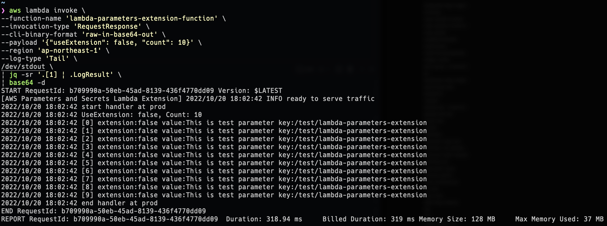
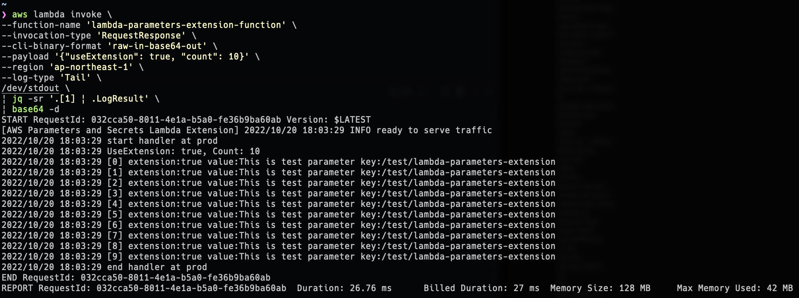

lambda-parameters-extension
===

Sample code of using Parameter and Secret Lambda Extension in container image. 

# Summary

## Get parameter by calling Parameter Store API using AWS SDK

## Get parameter by calling AWSParametersAndSecretsLambdaExtension API

# License

[MIT](https://github.com/michimani/lambda-parameters-extension/blob/main/LICENSE)

# Author

[michimani210](https://twitter.com/michimani210)